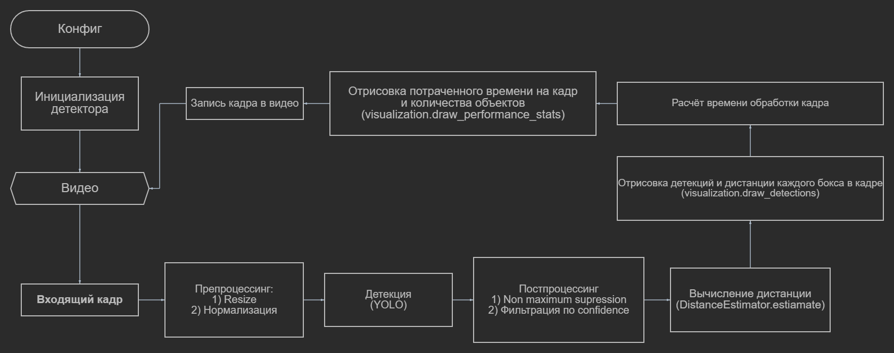

# detection-and-estimation-distances 🚋

<div align="center">

**Система компьютерного зрения для обнаружения объектов и оценки расстояний**

</div>

## 📋 Оглавление

- [Обзор](#обзор)
- [⚙️ Установка и использование](#установка-и-использование)
- [📊 Производительность](#производительность)
- [📁 Структура проекта](#структура-проекта)
- [Тесты](#тесты)

## Обзор

**Tram CV System** - это система компьютерного зрения реального времени, разработанная для обнаружения объектов и оценки расстояний. Система оптимизирована для работы на маломощных CPU-устройствах.

### ✨ Ключевые возможности

- 🎯 **Обнаружение объектов** в реальном времени с использованием YOLO
- 📏 **Оценка расстояний** до обнаруженных объектов
- ⚡ **Оптимизация под CPU** - работа без GPU
- 📊 **Мониторинг производительности** с метриками в реальном времени
- 🧪 **Комплексное тестирование** - unit, performance и интеграционные тесты

### Установка и использование

```bash
# Клонируйте репозиторий
git clone https://github.com/Alexander1Konstantinov/detection-and-estimation-distances.git
cd detection-and-estimation-distances

# Установите зависимости
pip install -r requirements.txt

# Запустите на тестовом видео
python main.py --source path/to/video.mp4

--verbose True/False для вывода информации о результате обработки каждого кадра
--output_path: str для пути сохранения итогового видео
```

В config/settings.py:
В ModelConfig можно поменять размер кадров(IMG_SIZE), путь до весов модели(MODEL_PATH) и нужно ли использовать квантизацию(Quantization)
В DistanceConfig можно добавить или изменить примерную ширину нужных классов (нужно для расчета расстояния до объекта), поменять фокусное расстояние камеры

### Производительность
В среднем каждый кадр обрабатывается менее чем за 50 мс на CPU

### Структура проекта

config/ - Параметры для модели детекции и измерения дистанции до объектов

test/ - Все тесты

src/models - Модель детекции и функции для расчета дистанции

src/pipeline - Здесь прогоняется пайплайн проекта

src/utils - Утилита для визуализации детекций

### Пример работы
https://drive.google.com/file/d/1GAa_uoBwqtAB8yJWW4S2GiGV5ATdKhpS/view?usp=sharing


## 🏗️ Архитектура системы

<div align="center">

<br>
<em>Рисунок 1: Блок-схема обработки видео</em>
</div>


## Тесты

Perfomance тесты: 
  
  - Измеряется время инференса и проверяется на то, что оно меньше 100мс
  
  - Время инференса замеряется на изображениях разного разрешения
    
  - Замеряется время инференса на небольшом видео
    
  - Замеряется использование памяти

    
Unit тесты:

  - Тест на инициализацию детектора и проверка типов
    
  - Тест детекции на одном изображении (проверка нужных атрибутов)
    
  - Тест для проверки работы оценки расстояния для известных и неизвестных классов
    
  - Тест для отрисовки фрейма (проверка на размерность)
    
Integration тесты:

  - Тест полного пайплайна с различными настройками

